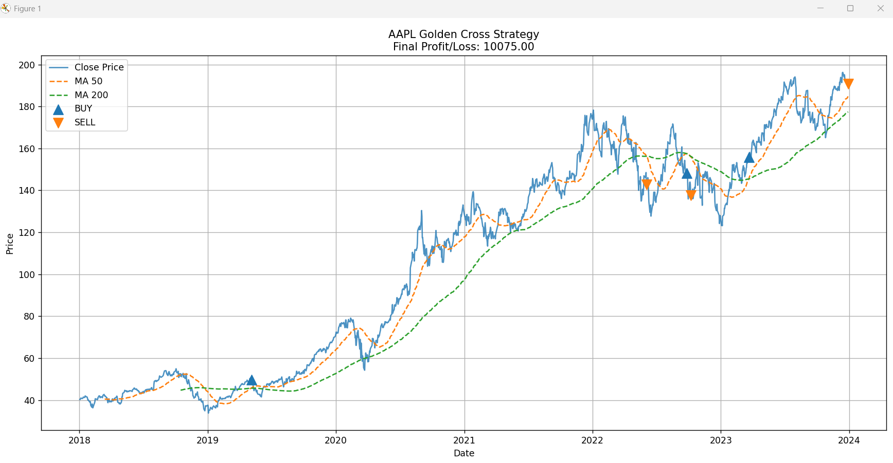

# Algorithmic Trading Adventure  
## Golden Cross Strategy using Python

---

##  Project Overview
This project is a **class-based algorithmic trading simulator** built using Python.  
It analyzes **historical stock market data** and automatically makes **buy and sell decisions** based on the **Golden Cross trading strategy**, while managing a fixed investment budget of **$5000**.

The project performs **paper trading (simulation)** and evaluates performance by calculating the **final profit or loss**, along with a **visual graph** to clearly explain the trading decisions.

---

##  Objectives
- Fetch historical stock data using Python  
- Perform data cleaning and preprocessing  
- Calculate technical indicators (moving averages)  
- Detect Golden Cross and Death Cross signals  
- Simulate buy and sell actions with a fixed budget  
- Calculate total profit or loss  
- Visualize price, indicators, and trade signals  

---

##  Trading Strategy: Golden Cross

### Indicators Used
- **50-Day Moving Average (MA50)**
- **200-Day Moving Average (MA200)**

### Trading Rules
-  **BUY** when MA50 crosses **above** MA200 (Golden Cross)
-  **SELL** when MA50 crosses **below** MA200 (Death Cross)
- Only **one open position at a time**
- Maximum shares purchased must fit within the **$5000 budget**
- Any open position is **forcefully closed on the last trading day**

---

##  Technologies Used
- **Python**
- **pandas** – data processing
- **yfinance** – historical stock data
- **matplotlib** – data visualization
- **Object-Oriented Programming (OOP)**

---

## 📁 Project Structure
Algorithmic Trading Adventure/
│
├── trading_bot.py
├── requirements.txt
└── README.md


##  How to Run the Project

###  Clone the Repository
```bash
git clone https://github.com/Shuvo3128/algorithmic-trading-adventure.git
cd algorithmic-trading-adventure

## Install Dependencies
pip install -r requirements.txt

## Run the Trading Bot
python trading_bot.py

## Output
## 📊 Output

When the program runs, it will:

- Print **BUY** and **SELL** actions in the terminal  
- Display the **final profit or loss**  
- Open a **graph window** showing:
  - Close price  
  - 50-day moving average  
  - 200-day moving average  
  - Buy (▲) and Sell (▼) points  

### Example Output
FINAL RESULT: PROFIT 
Final Profit / Loss: 10075.00

### 📉 Strategy Visualization Example




